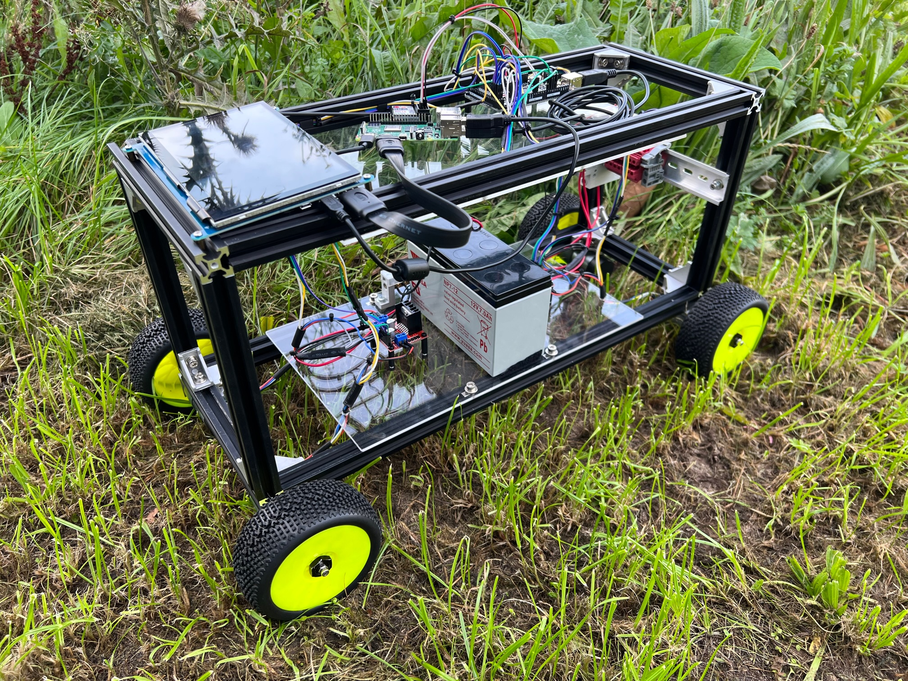

# In-field Robotic Blockchain Crop Assurance and Localisation

This project is a proof-of-concept infield robotic blockchain crop assurance and localisation pipeline using smart contracts deployed on the Ethereum network to notarise, store and retrieve images from the Interplanetary File System (IPFS) that have been successfully aligned to show a localisation match within an infield environment. 

The process is deployed using OpenScout, an opensource hardware and software mobile robot. 

Localisation is achieved by using images of ground stones taken adjacent to planted seeds to enable sub GNSS accuracy without expensive hardware requirements such as RTK-GNSS. This offers a novel way for low ground coverage crops such as onion, asparagus or turnips to be re-identified to provide potential for improved supply chain assurance.  

## Who is this project intended for?

This project is intended to be used, extended and developed upon by undergraduate students and early researchers who have an interest in smart agriculture, applications of robotics and autonomous systems in agri-tech, applications of decentralized ledger technologies and those interested in the potential of image technologies. Minimal technical expertise is required and any person who is undertaking an undergraduate course in STEM would be able to follow these instructions to deploy and build on this project.

## Table of Contents

* [OpenScout Mobile Robot](#OpenScout-Mobile-Robot)
* [Building your own OpenScout](#Building-your-own-OpenScout)
* [How to Install and Run the Assurance and Localisation Project](#How-to-Install-and-Run-the-Assurance-and-Localisation-Project)
* [How to Use the Project](#how-to-use-the-project)
* [Suggested Improvements](#suggested-improvements)
* [Acknowledgements](#acknowledgements)
* [Licence](#licence)

## OpenScout Mobile Robot

OpenScout is a low-cost open source hardware and software mobile robot that can be used for both indoor and outdoor tasks, transporting up to 15kg of payload. The robot is designed to be easily and cheaply (350USD) buildable and modifiable by non-specialists, and to function as a new standard physical platform for robotics research and real-world tasks, replacing current proprietary options. Example applications include last mile and factory floor delivery, site survey and monitoring, and agricultural crop operations.

OpenScout is made of standard sizes aluminium extrusions making it very modular. That means its chassis design depends on the use case and the needs of the user. The robot provides the bare minimum (wizard-of-oz tele-operation and software for controlled differential drive) and future versions will introduce more chassis configurations, ROS/ROS2 integration and gazebo urdf files.

<p align="center" width="100%">
    
</p>


## Building your own OpenScout
Materials used:
The robot consists of 200mm & 300mm 20x20 aluminium extrusions connected with 90 degree angle joints so the width, length and its height can be highly adjustable. We suggest also the [90:1 12V CQrobot](https://www.amazon.co.uk/CQRobot-90-Gearmotor-oz-Diameter/dp/B0887RR8SH) motor with encoder, as 4 of them provide enough traction to carry big payloads. Finally, an Arduino Mega is necessary as it provides enough interrupt pins for the RF receiver and the motor encoders.

The full bill of materials depends on each configuration and for more details please refer to the tutorials.

## Assembly Tutorial:

A fully documented assembly tutorial for the OpenScout with a 'Lazy Susan' revolute hinge is available below. Additionally, a comprehensive and fully annotated [Assembly Manual](Documentation/CAD_Files/Instruction_Manual/InstructionManual.pdf) with step by step 3D projections of the hardware build has been made available to print out. All associated CAD files and schematics are available in the [Documentation](Documentation) directory.

[OpenScout robot with 'Lazy Susan' revolute hinge](Hardware/robot_with_lazy_susan_bearing/README.md)


## How to Install and Run the Assurance and Localisation Project
This installation guide is a quick start to get you onto the right path to build you own smart contracts. This will take you through each of the steps required to replicate the vision localisation pipeline. Web3 libraries and several dependencies will be required as well as supporting tool chains. These should be widely available for your chosen operating system. 

With the below step by step guide, you should be able to get the pipeline working, experience smart contracts for yourself, as well as run your own blockchain (and see it operate in real time) even with limited experience. If you see any errors they are my own. Please feel free to make a pull request to improve this document. 

### 1. Install Node.js
To install Node.js visit [nodejs.org](https://nodejs.org/en/) and follow the installation instructions for your operating system.

### 2. Install Truffle and Gananche
After you have installed Node.js, type the following command into your terminal to install Truffle:

```
npm install truffle -g
```

Check that you have correctly installed it by reviewing the version:

```
truffle version
```

You should hopefully see something similar to the below in your terminal:

```
Truffle v5.5.17 (core: 5.5.17)
Ganache v^7.1.0
Solidity - 0.8.14 (solc-js)
Node v16.15.1
Web3.js v1.5.3
```

Truffle comes with a client version of Ganache but you should ideally get the GUI. This allows to you to clearly see what is happening on your bloockchain as well as details of each of the contracts you migrate. You should install the GUI from the [trufflesuite.com/ganache/](https://trufflesuite.com/ganache/) website. Then follow the installation instructions for your own operating system. 

### 3. Start your own project

To start your own project, change directory into a project folder or create a new empty folder on your desktop if you have not got one. Then, open a terminal in that folder and type:

```
truffle init
```
This will create a new project which will now have three new folders and a .js config file. The three folders and one file are automatically generated and will be called, ```contracts```, ```migrations```, ```test``` and ```truffle-config.js```. 

The contracts folder will contain the smart contracts, the migrations folder will contain the deployment files. The test folder is a place to test the logic of the contracts before they go into production.

Before we start the next step, we need to amend the truffle-config.js file. Here, we need to un-comment the part of the configuration file where we define the network to be used. This will ensure we correctly interact with the Ganache interface. Make sure that the below line (around line 45) is un-commented:

```
host: "127.0.0.1", // Localhost (default: none)
```

### 4. Compile the smart contract

This is the exciting bit! The best place to begin is by cloning this repo' and taking the files provided as the project you created in step 3 (assuming it was on a folder on your desktop). 

You can do this by either the GitHub desktop tool or by installing Git on your system, navigating to your project Desktop (as an example) and typing:

```
git clone https://github.com/garry-clawson/Blockchain-Crop-Assurance-and-Localisation.git
```

This will clone the folder to your desired location. You will then have all the files needed when copying and pasting across into your project folder. Once you have this, do the following:

* First, take the ```ImageStore.sol``` and place into your ```contracts``` folder. 

* Second, take the ```2_deploy_contract.js``` and place it into your ```migrations``` folder. The '2' at the start of the file name indicates that this is the 2nd file to be compiled (this is how Truffle knows the ordering of compilation). 

The ```ImageStore.sol``` file is a Solidity program ([Solidity](https://docs.soliditylang.org/en/v0.8.14/) is one programming language you can use to develop smart contracts on the Ethereum blockchain), and has three simple functions: ```addItem()```, ```getListItem()``` and ```getListSize```. 

* ```addItem()``` appends a string to a list that was created at the very top of the contract. This is used to keep on adding new content identifiers (CID) to the contract. The CID is the returned value we get when we have uploaded our image to the [Interplanetary File System (IPFS)](https://ipfs.io). This is our decentralized storage that we call on to host our data. The CID allows us to later retrieve our data (our image) from IPFS. 

* ```getListItem()``` returns the CID string of an indexed element from the List data structure. 

* ```getListSize``` returns the size of the List. This is mainly used to see how many CIDs we have stored in our contract. 

Now we have each of the files in place. We are ready to compile the project. To compile the project type the following in your terminal:

```
truffle compile
```

If it has compiled successfully you should have something like the below in your terminal:

```
Compiling your contracts...
===========================
> Compiling ./contracts/ImageStore.sol
> Compiling ./contracts/Migrations.sol
> Artifacts written to /Users/garryclawson/Desktop/Project/build/contracts
> Compiled successfully using:
   - solc: 0.5.16+commit.9c3226ce.Emscripten.clang
```

If you do have any trouble there is plenty of support on the web. An item that may cause an issue is defining the default compiler in the ```truffle-config.js``` file. If you do have this issue, comment out line 87 in the ```truffle-config.js``` file so that the default compiler for truffle will be used. 

Now that you have compiled your project you will see one new folder ```build/contracts``` that contains two new files ```ImageStore.json``` and also ```Migrations.json```. 

These are for the contract artifacts, which hold all the necessary information for deploying and interacting with the smart contracts.

### 5. Deploy the contract to Ganache

[Ganache](https://trufflesuite.com/ganache/) is a locally hosted blockchain used for development of smart contracts as well as other testing requirements. Here we are safe to deploy and try out all of our contract calls in a safe way, safe in the knowledge that we will not be spending any 'actual' funds (i.e. Gas > Eth). Ganache also allows us to connect our projects so that we can see what is happening under the hood in the smart contract, as well as estimate the Gas costs required for each stage of deployment and costs for interaction with the smart contract (i.e. writing to it to append the list). 

To deploy (called migrate) the contract to Ganache, type the following:

```
truffle migrate
```
If everything went to plan, we should see that in Ganache the contract has been sent to the blockchain and current block height has incremented. To see the actual contract state you will need to add a workspace to the Ganache GUI. The 'Contracts' tab on the GUI will take you through how to do this (2 very simple steps that takes less than 10 seconds and just requires linking the ```truffle-config.js``` file). 

The contract has now been deployed and is ready for us to use and interact with as we wish. The next steps will be interacting with the contract by adding the IPFS CIDs (from our uploaded images).

### 6. Interacting with the smart contract

The smart contract can be interacted with via the terminal using Truffle commands, however we want to interact with the contract in a more automated way. This allows us to build broader pipelines and extend the project. 

To interact with smart contracts we will use ```web3``` tooling, specifically ```web3.py``` To install this on your system type the following into your terminal:

```
pip install web3
```

Note: You will need to have ```pip``` installed to use pip. For more information about web3 go to [web3.readthedocs](https://web3py.readthedocs.io/en/stable/quickstart.html). 

Now that web3 is installed. We will move the ```retrieve_image_cid.py``` and ```add_image_cid.py``` files and place them into your ```project > smart_contract``` folder. 

When the ```retrieve_image_cid.py``` script is run, it asks for your smart contract address (this can be found on the 'Contracts' tab next to the ImageStore contract) and and also a CID (whihc will look something like: ```QmWmXVKwg3PypTWNt9GSWvZHftDTEbJSyBkXH4rGaUFnh9```), to append the list within the smart contract. The content identified (CID) is specific to the image uploaded to IPFS. The act of appending this value to the blockchain is effectively notorising it. Remember, when a contact has been migrated to the blockchain it is not possible to amend it. So if there is a mistake, it is not possible to change it. 

#### Add an image CID to the smart contract

To run ```add_image_cid.py``` open a terminal and make sure you are in the ```project > smart_contract```directory and type:

```
python add_image_cid.py
```

You will then be asked to enter your Ethereum ImageStore contract address and CID. Once you have entered this information, you should get something similar to the below:

```
Enter your Ethereum ImageStore contract address: 0xA40e776DDAB373960dA5F6FC170743A9DAe51204
List size:  2
CID added:  QmcBRbromnTm4dGRzrH2mFJCCwFBxBwhyegRoDGefdbC62
tx_hash: 0x9585e039227b6cb19e1492fe61a6dbe601a033e1cb2d36f014aa091526623392
```

We can see from the above that there are 2 items in the list (the list starts at 1 and not 0), and the last item added is ```QmcBRb...``` and it has an associated transaction hash of ```0x9585e0...```. The transaction hash is the associated transaction in the blockchain and can be seen when inspecting transactions on the Ganache GUI. This is how we identify that an actual transaction has taken place. 

If there is an error, it is most likely due to the contract having an empty list and the ListSize() function returning an exception. To avoid this make sure you first add a CID to the smart contract by following the pipeline process outlined in [How to Use the Project](#how-to-use-the-project). 

#### Retrieve an image CID from the smart contract

To run ```retrieve_image_cid.py``` open a terminal and make sure you are in the ```project > smart_contract```directory and type:

```
python retrieve_image_cid.py
```

You will then be asked to enter you Ethereum ImageStore contract address and the position of the CID in the list. Once you have entered this information, you should get something similar to the below:

```
Enter your Ethereum ImageStore contract address: 0xA40e776DDAB373960dA5F6FC170743A9DAe51204
List size:  2
CID:  QmcBRbromnTm4dGRzrH2mFJCCwFBxBwhyegRoDGefdbC62
```

For this proof-of-concept no optimization has been completed. We are currently using a very simple list structure and have to remember what image referred to what CID. In Solidity there is no simple way to search a list for as each step will incur a Gas cost. Other data structures will offer a better way to do this, but for a proof-of-concept, it is fine! 


### 7. Aligning an image

The image alignment process was inspired by the [pyimagesearch tutorial](https://pyimagesearch.com/2020/08/31/image-alignment-and-registration-with-opencv/) for document image alignment and registration. The concept of aligning infield ground stones and using the same type of registration is compelling as a low cost method to localize using only a simple vision system. 

To align an image the ``` align_stone_image.py``` script is called. To call this script, make sure you are in the same directory; then the following usage is required:

```
python3 align_stone_image.py --template images/template_ground_stone_plan_view.jpeg --image images/template_ground_stone_90_degree_rotated_45_degree_incline_side_view.jpeg
```

So what is happening here? Here, we are taking a template image ```template_ground_stone_plan_view.jpeg``` (this is an image that has been taken by the robot when planting the seed and is a direct plan view adjacent to the planting site), and comparing it to a newly current taken image ```template_ground_stone_90_degree_rotated_45_degree_incline_side_view.jpeg```. 

To play around with image alignment and registration using some more images (this could be ground stones, a picture of your house or even book covers!) the general usage is below:

```
python3 align_stone_image.py --template path/to/your/template/image --image path/to/your/current/image
```

Several more 'template' and 'current' ground stone images are available in the ```images > additional_images``` folder. 

If the image is successfully able to be aligned then a ```Success...``` message will be shown. The current system will attempt to align any image so badly aligned images will look very bad. 

In our example, the newly current taken ground stone image is heavily rotated and banked to show the full alignment process. In practice, as the robot moves up and down a row, the newly taken image will be very similar (i.e. directly overhead) to the template image taken during seeding. 

Since this ground stone image (given as an example) is successful, we shall now upload it to IPFS. Further images to test alignment are available in the ```image_registration > images > additional_images``` folder. 

### 8. Upload image to IPFS

The IPFS is accessible via an [Infura API](https://infura.io/product/ipfs) endpoint. Whenever a user uploads text, files, images etc to IPFS a content identifier (CID) is returned. This looks similar to ```QmcBRbromnTm4dGRzrH2mFJCCwFBxBwhyegRoDGefdbC62```. This CID is what is uploaded to the smart contract described in Step 6. 

The ```ipfs_upload.py``` file is used to upload an image to IPFS. This takes an image (currently the ```template_ground_stone_plan_view.jpeg``` image used as an example, but this should be your successfully aligned image). To run the script using the example image open a terminal and change directory to the ```Project > ipfs``` folder. Then type:

```
python3 ipfs_upload.py
```

You should then get returned a CID as described above which will look similar to ```QmcBRbromnTm4dGRzrH2mFJCCwFBxBwhyegRoDGefdbC62```. 

### 9. Download an image from IPFS

Downloading an image from IPFS is almost exactly the same as uploading and image, except that we are 'getting' rather than 'adding'. We use the same Infura API for access and take a content identifier (CID) as seen in step 8 to find the requested file. Since we are using an example image and will be writing this to the same folder as the ```template_ground_stone_plan_view.jpeg```, we will call this returned image ```returned_template_ground_stone_plan_view.jpeg```. Line 27 declares the get_image() function and states where this image should be written to. Feel free to change this as you need. To download an image make sure you are in the ```project > ipfs``` folder and type the following into your terminal:

```
python3 ipfs_download.py
```

You will be asked for the CID of the required image so that the IPFS can find the required file. 

## How to Use the Project

The [How to Install and Run the Project](#how-to-install-and-run-the-project) section above describes how to get all the pieces of the pipeline. However, they are in a natural order for understanding the system and getting it working but not for actually operating the pipeline. This section will describe what part to run and in what order to see a successful pipeline flow. This order is as follows:

#### Prepare the pipeline
1. Create your smart contract (steps 1-5)
2. Upload a template image to IPFS and get a returned CID (step 8)
3. Add the CID of template image to the list in the smart contract (step 6)
4. Repeat process 2-3 for all of the template images (i.e. for all images taken adjacent to a planted seed)

#### Execute the pipeline
5. Take a current image and save to images directory *(Note: this will be compared - aligned - to the template image)*
6. Recall the CID of the template image from the smart contract (step 6)
7. Download the template image from IPFS using the recalled CID (step 9)
8. Align the current image with the template image (step 7)
9. If all goes well and alignment is successful, upload the current image to IPFS (step 8)
10. Repeat the process from stage 5-9 *(Note: to do this you will need a collection of template images)*

## Suggested Improvements

Multiple improvements can be made to this pipeline in the underlying scripts and the smart contracts to make the system automated. A few (non exhaustive) ideas are below:

* Improve the alignment process on ground stones - this is currently very simple and enhanced feature detection and segmentation would improve the accuracy (note, we are not looking to see if the images are the same, just if they can be aligned to a high accuracy)
* Build in an accuracy model to provide a Yes/No result for image alignment
* Identify a better way to take images to achieve an improved alignment accuracy (currently, this is a static camera on the front of the open hardware robot). 
* Use GNSS to identify what template image is required and call it from IPFS (this will need an interaction with the smart contract to get the relevant CID)
* Create a better way to get a relevant CID from the list in the smart contract
* A method to automatically upload a CID to the smart contract once it has been given to the user 
* Automate the pipeline so that once a current image is taken it will automatically feed through the alignment, storage and smart contract process

## Acknowledgements

The following medium posts [[1]](https://medium.com/coinmonks/creating-and-deploying-smart-contracts-using-truffle-and-ganache-ffe927fa70ae), [[2]](https://medium.com/thecryptoelement/developing-a-todo-list-dapp-in-ethereum-e4daf8a9ea5c), [[3]](https://medium.com/swlh/develop-test-and-deploy-your-first-ethereum-smart-contract-with-truffle-14e8956d69fc) and documents [[4]](https://trufflesuite.com/docs/truffle/quickstart/) were extremely useful when writing up this overview. Additionally, online resources [[5]](https://trufflesuite.com/docs/truffle/quickstart/), [[6]](https://nodejs.org/en/), [[7]](https://trufflesuite.com/ganache/), [[8]](https://www.dappuniversity.com/articles/web3-py-intro), [[9]](https://opencv.org)  and [[10]](https://pyimagesearch.com/2020/08/31/image-alignment-and-registration-with-opencv/) were extremely useful for putting the project together.


## License

This project is licensed under the [GNU General Public License v3.0](LICENSE) and [CERN-OHL-W](LICENCE) and [CC BY-SA](CC-BY-SA_LICENCE)

